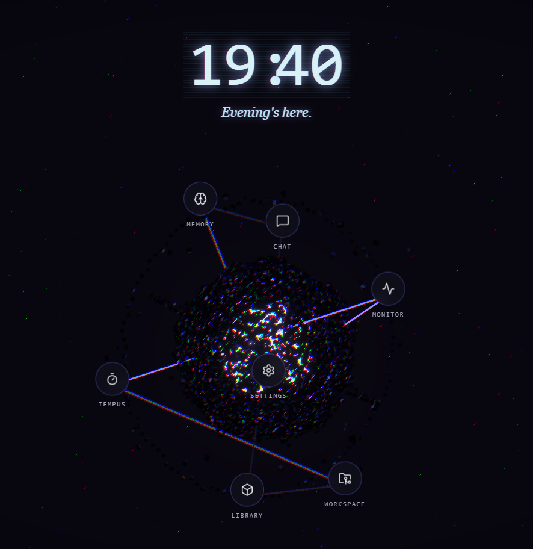
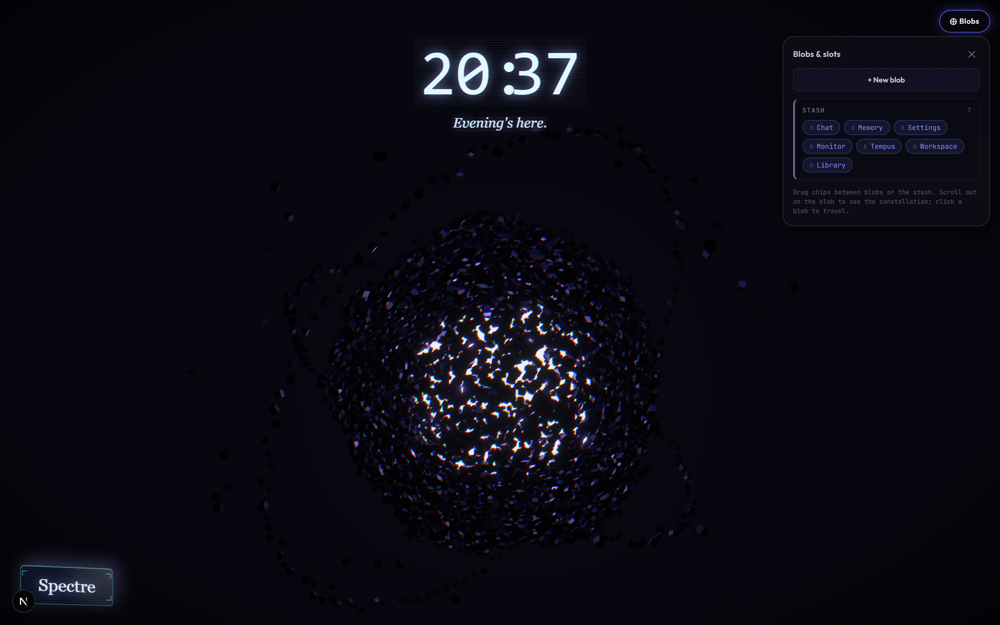
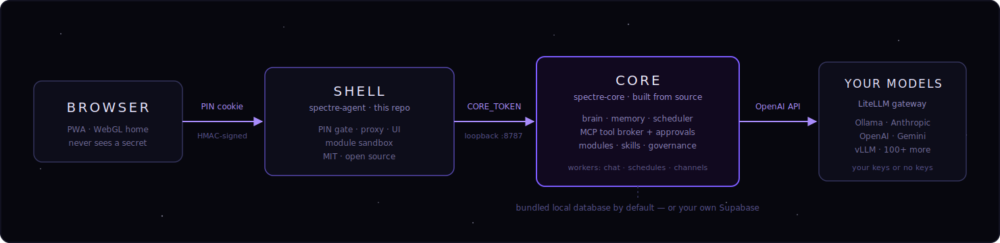

<div align="center">


**A ghost for your machine. It works for you, remembers you, and answers to nobody else.**

Spectre is a self-hosted AI agent. It keeps real memory, runs real tools under rules you set, and grows through modules you can write yourself. Your hardware, your models, your keys. Wear the 3D interface or run it invisible.

[](https://github.com/EliasT5/spectre-agent/actions/workflows/ci.yml)
[](LICENSE)
[](#quick-install)
[](#what-it-can-do)



*The home screen. A living blob of voxels with your modules in orbit. Also entirely optional.*

</div>

---

## Quick Install

**Linux / macOS**

```bash
curl -fsSL https://elias-teubner.dev/install.sh | sh
```

**Windows (PowerShell)**

```powershell
irm https://elias-teubner.dev/install.ps1 | iex
```

One line. The installer brings everything else, and if git, Docker or Node are missing it offers to install them too. Then it asks three questions:

- **Which database.** A bundled local one (default, no cloud account anywhere) or your own Supabase project.
- **Which brain.** Local Ollama by default, zero API keys. Or any provider through the gateway.
- **How much Spectre:**

| Install profile | What you get |
|---|---|
| **Headless** | The ghost without the shell. Runs on a server, talks through Telegram, WhatsApp, Discord or raw HTTP. |
| **Standard** | The web app plus the essentials: chat, memory, monitor, settings. The default. |
| **Full** | The whole haunted house: web app, Tempus time tracking, and the Workspaces code IDE. |

Already cloned? Run the wizard directly:

```bash
node installer/install.mjs
```

With a UI profile, open **http://127.0.0.1:3100** and enter your PIN. Headless, just message your bot.

> **Note:** the brain ships as a prebuilt, multi-arch image (`ghcr.io/eliast5/spectre-core`). The installer pulls it. You never build it.

---

## Modules

Look at the blob. Every orb circling it is a module. Chat is a module. Memory is a module. The monitor, the PDF library, settings: modules. The platform they run on is the same one you get to build on, same rules, same guardrails.

<div align="center">


*Your modules in orbit. Drag, recolor, rename. Or add a new orb you wrote yourself.*
</div>

So when Spectre is missing something you want, you don't file a feature request. You build a module:

- **Data mode.** Write a JSON description: widgets, data, actions. Spectre draws it in the house style. No build step, nothing to compile, and no way to inject code, because the schema is data.
- **Code mode.** Ship real code. Spectre treats it like a stranger in the house: fingerprint-checked (SHA-384) before a single byte runs, locked in a sandboxed iframe, no network of its own, and a short read-only list of SDK calls with rate caps.

Whoever wrote it, every module gets the same deal:

- **Private storage.** Its own key-value and row store, pinned to its id by the core. No peeking at other modules' data.
- **Only the capabilities you grant.** The manifest asks, you decide. Fetches go through an allowlist and get logged.
- **The house rules.** Module actions pass the same permission gate and quotas as everything else.
- **Signed manifests.** An ed25519 keyring (`SPECTRE_MODULE_TRUSTED_KEYS`) verifies who made it. Tampered or unsigned? Refused.
- **Drop-in install.** Put it in the data dir. The registry checks the manifest before anything wakes up.

Build your first one: [`docs/MODULES.md`](docs/MODULES.md).

---

## The shell comes off

The 3D home is a window. Close it and Spectre keeps working:

- **Text it.** Telegram, WhatsApp and Discord ride the same conversation engine. Replies come back to the channel, images included.
- **Walk away.** Every turn runs on the server. Shut your laptop mid-answer; the answer finishes and waits for you.
- **Let it run errands.** Recurring reports, check-ins, the nightly memory cleanup, all on the built-in scheduler.
- **Script it.** The whole core is one HTTP API behind one token. cron it, pipe it, wire it into anything.
- **Stay reachable.** It still pings your phone when something matters.

And if you don't like this shell? Build your own. It's MIT, it holds no data, and every feature you see is an API call. Fork it, reskin it, or replace it from scratch. Spectre won't take it personally.

---

## What it can do

**Any brain.** One agent loop speaks the OpenAI API to a [LiteLLM](https://docs.litellm.ai) gateway: Anthropic, OpenAI, Gemini, Bedrock, Azure, Ollama, vLLM, 100+ backends. Local models need no keys at all. Pick a model per message or let the router decide.

**Tools, on a leash.** Around 50 of them: shell, files, calendar, schedules, screenshots, modules. Every call passes an approval gate with saved permissions and quotas. Disk-wiping commands get blocked before the approval prompt even appears. A daily spend cap cuts off paid models at your limit; local models run free forever.

**A memory that sticks.** Tell it once and it finds the fact later by meaning, not keywords, even from another conversation. At night it dreams: merges duplicate memories, lets stale ones fade. Feed it PDFs and it answers from them.

**It trains itself.** Skills are written guides the agent follows. Spectre tries a skill, scores the result, proposes an edit, and keeps it only if it beats held-out tests. Then it waits for your sign-off. The workshop can even edit its own code, on a branch, never landing without you.

**Autonomy, off by default.** A heartbeat can wake it for small background runs: capped budget, tool allowlist, hard time limit. Until you flip that switch, it does nothing on its own.

**It tells on itself.** Problems get logged, critical ones hit your phone, and the health probe reports red over a broken stack instead of smiling.

---

## Why this exists

I built Spectre for my ADHD. Boring tasks pile up, and executive dysfunction makes starting them the hardest part. I wanted something that helps me lock in. Not another thing to manage.

It started as a simple chatbot. Then it grew tools and became an agent. Then it got a voice and took over my calendar. Then it started doing tasks on its own when it judged them useful. I built a coding space into it so it could watch me work. I juggle a lot of projects and couldn't care less about time logging, but my employer does, so I built Tempus, a time tracker, right into it.

Then a friend saw it running and asked if I'd tried Hermes. I said no. Everything Hermes has that I need, mine already had. Whatever it lacks, I can build as a module. He said: then why not open-source it. So here we are.

This is an early version and it will keep improving. I daily-drive a private build with more capabilities, and I'm moving them over one by one, each once it's stable enough (to the best of my abilities) to hand to strangers. Expect steady updates, not a finished product.

---

## Provider rules

Spectre's standard brain talks to a gateway you control, with your own API keys or your own local models. That is the supported path. Configure it in `spectre-core` (`docker-compose.yml` plus `litellm-config.yaml`).

> ### A note on subscriptions
>
> In theory, Spectre can run on a personal AI subscription instead of metered API keys. OpenAI and Google allow that, so the Codex and Gemini paths exist and you can switch them on in the config. Anthropic's consumer terms do not allow it, so out of respect for them the Claude path ships disabled and stays disabled. The default brain is your own API key through the gateway, or a local model with no keys at all.
>
> If anyone at Anthropic wants to talk about this, my inbox is open through this repository.

---

## How it's built

Two halves.

This repo (**`spectre-agent`**) is the shell: the optional UI and a thin proxy. MIT, open, yours to gut.

The brain (**`spectre-core`**) is private: model routing, memory, tools, modules, scheduling, autonomy. It ships as a sealed image, binds to a loopback port, and answers nothing without the token. Get past the PIN somehow and the brain still won't talk to you.



| Piece | Where |
|---|---|
| PIN / session gate (browser edge) | `src/proxy.ts`, `src/lib/session.ts` |
| Catch-all proxy to the core (adds `CORE_TOKEN`, streams SSE through) | `src/app/api/[...path]/route.ts` |
| Blob home and module slots | `src/components/blob/*` |
| Module runtimes: data-mode renderer and code-mode sandbox | `src/components/ui/SchemaRuntime.tsx`, `src/components/ui/ModuleFrame.tsx` |
| Tabs (chat, monitor, memory, settings, modules) | `src/app/*` |
| Provider-agnostic brain | `spectre-core`, OpenAI-compatible tool loop |
| Tool execution and governance | `spectre-core`, MCP broker |

The shell handles the PIN. The core checks `CORE_TOKEN`. The `/api/auth/pin` route is answered in the shell, so your PIN never reaches the core. Everything else under `/api/*` passes through untouched.

More compose profiles: `--profile screenshot` (Playwright capture), `--profile workspace` (an embedded code IDE), `--profile self-evolve` (the workshop worker). Telegram setup lives in `.env.docker.example`.

---

## Coming from Hermes or OpenClaw?

Bring your stuff:

```bash
node installer/import-configs.mjs
```

It finds your existing install, lifts the provider keys, channel tokens and preferences into Spectre's `.env.docker`, and stages your persona and memory files for adoption. You don't start from zero.

---

## Documentation

| Doc | What's in it |
|---|---|
| [`docs/M6-INSTALLER.md`](docs/M6-INSTALLER.md) | Full install and operations guide, troubleshooting |
| [`docs/MODULES.md`](docs/MODULES.md) | Module SDK: build your own tools and screens |
| [`.env.docker.example`](.env.docker.example) | Every knob, documented |
| [`SECURITY.md`](SECURITY.md) | Reporting and the threat model in brief |
| [`CONTRIBUTING.md`](CONTRIBUTING.md) | How to help |

---

## License

MIT for this shell, see [LICENSE](LICENSE). The core ships as a sealed binary image and is free to use.

Issues and PRs welcome.
